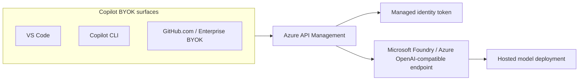

# Reference architecture



## Design

Any Copilot BYOK surface — VS Code, the Copilot CLI, or GitHub.com (enterprise BYOK) —
talks only to APIM as an OpenAI Chat Completions endpoint. APIM:

- authenticates to the backend with managed identity
- routes to a named backend entity (`foundry-backend`) that targets the Foundry deployment
- appends the required `api-version`
- preserves the OpenAI-compatible payload shape

The Foundry resource is treated as the model host. This keeps model access centralized, auditable, and easy to swap without changing the client contract. Because the contract is identical across surfaces, the same gateway serves individual (VS Code, CLI) and enterprise (GitHub.com) BYOK paths without change.

## Security model

- No API keys are stored in the repo.
- APIM uses Microsoft Entra ID managed identity for backend auth.
- The managed identity gets the `Cognitive Services OpenAI User` role on the Foundry resource.
- The backend URL and deployment name are parameterized so the same template works across environments.

## Backend resilience (optional)

Because Foundry/Azure OpenAI returns `429 Too Many Requests` with a `Retry-After` header (sometimes hours long) when a deployment is overloaded, the `foundry-backend` entity can carry a [circuit breaker](https://learn.microsoft.com/azure/api-management/backends#circuit-breaker). When the rule trips, APIM stops calling the backend for `tripDuration` and returns `503` to the client instead of hammering an overloaded deployment. Setting `acceptRetryAfter: true` honors the backend's `Retry-After` value.

This is not enabled by default. To turn it on, add a `circuitBreaker` block to the backend in `infra/main.bicep` (bump the backend API version to `2024-06-01-preview` or later for `acceptRetryAfter`):

```bicep
resource foundryBackend 'Microsoft.ApiManagement/service/backends@2024-06-01-preview' = {
  parent: apim
  name: backendId
  properties: {
    title: 'Microsoft Foundry'
    protocol: 'http'
    url: '${foundryBackendBaseUrl}/openai/deployments/${foundryDeploymentName}'
    circuitBreaker: {
      rules: [
        {
          name: 'foundryOverload'
          failureCondition: {
            count: 1
            interval: 'PT10S'
            statusCodeRanges: [
              {
                min: 429
                max: 429
              }
            ]
          }
          tripDuration: 'PT1M'
          acceptRetryAfter: true
        }
      ]
    }
  }
}
```

Notes:

- The circuit breaker is not supported on the **Consumption** tier.
- Tripping is per gateway instance and approximate; only one rule per backend is supported today.

## Repo shape

- `infra/main.bicep` provisions the gateway, the `foundry-backend` entity, and the access path.
- `infra/openapi/byok-proxy.openapi.json` defines the APIM-imported proxy API.
- `infra/policies/byok-proxy.xml` validates the client key, attaches the managed-identity token, and routes to the backend entity.

## Runtime flow

1. A Copilot BYOK surface (VS Code, CLI, or GitHub.com) sends an OpenAI-compatible chat request to APIM.
2. APIM acquires an Entra token with managed identity.
3. APIM forwards the request to the `foundry-backend` entity, whose URL targets the Foundry deployment endpoint.
4. Foundry returns the model response through APIM.

## Client configuration

This proxy is published as an OpenAI Chat Completions endpoint, so it plugs into every
Copilot BYOK surface. In all cases the API key is the **APIM subscription key** and the
model is your **Foundry deployment name**; the gateway adds the backend token and `api-version`.

- **VS Code (individual).** Manage Language Models → **OpenAI Compatible** provider (or **Custom endpoint** on Insiders), base URL `https://<apim-name>.azure-api.net/byok`.
- **Copilot CLI (individual).** Environment variables with the `openai` provider type:

  ```bash
  export COPILOT_PROVIDER_TYPE=openai
  export COPILOT_PROVIDER_BASE_URL=https://<apim-name>.azure-api.net/byok
  export COPILOT_PROVIDER_API_KEY=<apim-subscription-key>
  export COPILOT_MODEL=<your-foundry-deployment-name>
  ```

  Copilot appends `/chat/completions` to the base URL, matching the proxy operation.
- **GitHub.com (enterprise).** An enterprise owner registers the proxy once as an **OpenAI-compatible provider** under AI controls; the models then surface on GitHub.com, the CLI, and IDEs under the enterprise name.

Full per-surface steps are in [client-surfaces.md](client-surfaces.md).

## Constraints and limitations

- **Surface scope.** BYOK applies to chat, agent, and utility tasks only. Inline code completions always use GitHub-hosted models, regardless of surface.
- **Model capabilities.** The Foundry deployment must support tool calling and streaming; a context window of ≥128k tokens is recommended.
- **Provider type.** The proxy targets the `openai` / OpenAI-compatible provider at `/byok`. The `azure` provider type expects a `/openai/deployments/<deployment>/chat/completions` path that this proxy does not expose.
- **Wire API.** Only the Chat Completions wire API is proxied. Models that use the Responses API (Copilot calls `/responses`) need an additional operation. Enterprise BYOK also requires chat/Completions-style APIs.
- **Inbound auth.** The sample API sets `subscriptionRequired: false`. Production deployments should require an APIM subscription key and validate it in the inbound policy.
- **Enterprise BYOK is public preview** and subject to change.
