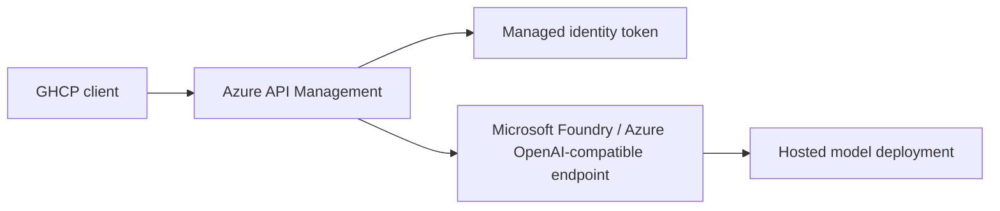

# Reference architecture

## Design

The client talks only to APIM. APIM:

- authenticates to the backend with managed identity
- rewrites the request to the Foundry deployment path
- appends the required `api-version`
- preserves the OpenAI-compatible payload shape

The Foundry resource is treated as the model host. This keeps model access centralized, auditable, and easy to swap without changing the client contract.

## Security model

- No API keys are stored in the repo.
- APIM uses Microsoft Entra ID managed identity for backend auth.
- The managed identity gets the `Cognitive Services OpenAI User` role on the Foundry resource.
- The backend URL and deployment name are parameterized so the same template works across environments.

## Repo shape

- `infra/main.bicep` provisions the gateway and access path.
- `infra/openapi/byok-proxy.openapi.json` defines the APIM-imported proxy API.
- `infra/policies/byok-proxy.xml` contains the request rewrite and auth logic.

## Runtime flow

1. GHCP sends an OpenAI-compatible chat request to APIM.
2. APIM acquires an Entra token with managed identity.
3. APIM rewrites the path to the Foundry deployment endpoint.
4. Foundry returns the model response through APIM.
