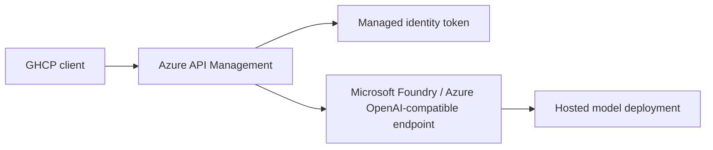

# Reference architecture



## Design

The client talks only to APIM. APIM:

- authenticates to the backend with managed identity
- rewrites the request to the Foundry deployment path
- appends the required `api-version`
- preserves the OpenAI-compatible payload shape

The Foundry resource is treated as the model host. This keeps model access centralized, auditable, and easy to swap without changing the client contract.

## Security model

- No API keys are stored in the repo.
- APIM uses Microsoft Entra ID managed identity for backend auth.
- The managed identity gets the `Cognitive Services OpenAI User` role on the Foundry resource.
- The backend URL and deployment name are parameterized so the same template works across environments.

## Repo shape

- `infra/main.bicep` provisions the gateway and access path.
- `infra/openapi/byok-proxy.openapi.json` defines the APIM-imported proxy API.
- `infra/policies/byok-proxy.xml` contains the request rewrite and auth logic.

## Runtime flow

1. GHCP sends an OpenAI-compatible chat request to APIM.
2. APIM acquires an Entra token with managed identity.
3. APIM rewrites the path to the Foundry deployment endpoint.
4. Foundry returns the model response through APIM.

## Client configuration (Copilot CLI BYOK)

The client side is plain Copilot CLI BYOK environment variables. Because the proxy is published as an OpenAI Chat Completions endpoint, use the `openai` provider type:

```bash
export COPILOT_PROVIDER_TYPE=openai
export COPILOT_PROVIDER_BASE_URL=https://<apim-name>.azure-api.net/byok
export COPILOT_PROVIDER_API_KEY=<apim-subscription-key>
export COPILOT_MODEL=<your-foundry-deployment-name>
```

Copilot appends `/chat/completions` to the base URL. The gateway adds the backend auth token and the `api-version`, so those concerns never reach the client.

Reference: [Using your own LLM models in GitHub Copilot CLI](https://docs.github.com/en/copilot/how-tos/copilot-cli/customize-copilot/use-byok-models).

## Constraints and limitations

- **Model capabilities.** The Foundry deployment must support tool calling and streaming; a context window of ≥128k tokens is recommended.
- **Provider type.** The proxy targets the `openai` provider type at `/byok`. The `azure` provider type expects a `/openai/deployments/<deployment>/chat/completions` path that this proxy does not expose.
- **Wire API.** Only the Chat Completions wire API is proxied. Models that use the Responses API (Copilot calls `/responses`) need an additional operation.
- **Inbound auth.** The sample API sets `subscriptionRequired: false`. Production deployments should require an APIM subscription key and validate it in the inbound policy.
